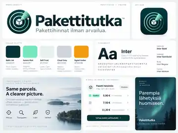

# Pakettitutka — Finnish Parcel Price Intelligence

[](https://github.com/MykolaDotsenko/test-assigment/actions/workflows/quality.yml)

**A Finland-specific parcel and courier comparison engine built around verified carrier tariffs instead of generic delivery estimates.**

[**Open the live app →**](https://test-assigment-theta.vercel.app) · [Architecture](./ARCHITECTURE.md)



## Why Finland-specific?

A generic “price per kilometre” estimator cannot be genuinely accurate for parcel delivery. Finnish carriers use different commercial models:

- Posti: consumer parcel sizes;
- Matkahuolto: consumer parcel sizes;
- GLS: consumer weight bands plus pickup/door options;
- PostNord: chargeable weight = max(actual, volumetric) plus fuel surcharge, VAT and possible handling fees;
- FedEx / UPS / DHL: list rates plus dynamic fuel, area and handling surcharges;
- DSV: contract/spot freight plus frequently changing fuel surcharges.

Pakettitutka therefore models each carrier separately and exposes an **accuracy label** for every result.

## Product experience

- branded, responsive comparison flow designed for desktop and mobile;
- transparent pricing confidence instead of a misleading single “estimate”;
- official tariff links embedded directly in results and carrier cards;
- separate public/no-contract and published business list-rate modes;
- no GPS or street address required; an optional business destination postcode is used only to detect PostNord's location-specific island/ferry surcharge;
- mainland-vs-Åland route selection asks only for location detail that changes a price;
- accessible controls, focus states and reduced-motion support;
- Finland-first visual system with a dedicated Pakettitutka asset library;
- branded web manifest/home-screen metadata and social preview;
- no service-worker tariff caching: freshness takes priority over offline behavior.

Brand assets live under `public/brand/` and are split into `logos/`, `visuals/`, and `mockups/`.

## Calculated carriers

### Posti — private sender

Official online/OmaPosti domestic prices from 2 June 2026:

| Size | Maximum size | Price |
| --- | --- | ---: |
| XXS | 3 × 25 × 35 cm, 2 kg | €7.90 |
| S | 11 × 32 × 42 cm | €9.90 |
| M | 19 × 36 × 60 cm | €11.90 |
| L | 36 × 37 × 60 cm | €16.90 |
| XL | 40 × 60 × 100 cm | €22.90 |
| XXL | longest side ≤ 200 cm, length + circumference ≤ 300 cm | €44.90 |

Minimum weight is 100 g. XXS minimum size is 1 × 15 × 15 cm; regular parcels use a 1 × 15 × 25 cm minimum. Maximum weight for S–XXL is 25 kg. Pakettitutka applies Posti's separate Åland tariff when the user selects a mainland ↔ Åland route; no exact postal code is required.

Source: https://www.posti.fi/en/sending/parcels/package-price-lists

### Matkahuolto — private sender

Current prices that the official public domestic page exposes directly:

| Size | Maximum size | Price |
| --- | --- | ---: |
| XXS | 3 × 25 × 40 cm | €5.90 |
| S | 10 × 40 × 55 cm | €8.80 |
| M | 20 × 40 × 55 cm | €11.80 |

Matkahuolto also offers larger sizes. Pakettitutka deliberately does **not** fill missing current consumer prices from old price lists. For Åland, Matkahuolto uses its international-parcel flow plus a ferry surcharge; Pakettitutka surfaces this as non-calculated coverage rather than inventing a flat total.

Source: https://www.matkahuolto.fi/packages/domestic-parcels

### GLS Finland — private / occasional sender

Official GLSpaketti.fi basic tariff:

- max 1 kg — €24
- max 3 kg — €29
- max 15 kg — €59
- max 25 kg — €79
- pickup from sender — +€20 / shipment
- delivery to recipient's door — +€5 / parcel
- door delivery is mandatory above 15 kg

Source: https://gls-group.com/FI/en/ship-with-gls/Consumers-Small-Businesses/

### PostNord — business/list-rate mode

Pakettitutka calculates PostNord **Automaatti** and **Palvelupiste** from the official 2026 list rate.

Pricing basis:

```text
volumetric weight = volume m³ × 280 kg
chargeable weight = max(actual weight, volumetric weight)
base freight       = official weight band
+ 10.4% fuel surcharge on freight only (effective 1 Sep 2026)
+ special handling if triggered
+ 25.5% Finnish VAT on the taxable subtotal
```

These are list-rate calculations, not negotiated contract prices.

Sources:
- https://www.postnord.fi/siteassets/pdf/hinnastot/online_hinnastoliite_2026-02-01.pdf
- https://www.postnord.fi/en/sending/fuel-and-sulphur-surcharge
- https://www.vero.fi/en/businesses-and-corporations/taxes-and-charges/vat/rates-of-vat/

## Carrier directory

Pakettitutka also lists major operators that cannot be honestly reduced to one static public price:

- FedEx — 2026 standard list rates + weekly fuel/area/handling surcharges
- UPS — rate guide + fuel/remote/demand surcharges
- DHL Express — live quote based on origin/destination, chargeable weight and service
- DSV Parcel / Schenker — contract/spot pricing; domestic parcel fuel surcharge 16.86% from 16 Sep 2026
- Budbee / Instabee — active Finnish e-commerce home/locker network; merchant pricing is account-specific
- Kaukokiito — Finnish nationwide freight/distribution; quote/agreement pricing
- Jetpak Finland — time-critical same-day/next-day courier; booking-specific quote
- DHL Freight — domestic/European road freight with changing published surcharges
- Bring — outbound shipments from Finland and domestic Finland services are discontinued

The UI links directly to official carrier sources.

## Tariff maintenance

Mutable carrier data is centralized in `src/data/finlandTariffData.ts`: published price bands, source URLs, snapshot date, fuel/VAT constants and PostNord island/ferry postcodes live there. Carrier eligibility, chargeable-weight math and quote composition remain in `src/domain/finlandTariffs.ts`.

This separation keeps routine tariff refreshes reviewable and reduces the chance of changing pricing algorithms while updating source data.

## Engineering rules

- fixed-size boxes are rotation-aware and enforce provider minimum as well as maximum dimensions;
- girth-based services use longest side + circumference;
- the UI asks only for mainland-vs-Åland routing because exact postcodes do not change the currently automated tariff formulas;
- Åland is treated separately where the official tariff differs;
- no price is invented when an official current tariff is unavailable;
- public/no-contract and published business list-rate prices are never silently mixed;
- PostNord fuel surcharge is applied to freight only, excluding additional-service fees;
- PostNord's €11.63 island/ferry surcharge is applied for official Finnish surcharge postcodes when an optional destination postcode is supplied;
- final carrier checkout/invoice remains authoritative;
- unsupported dynamic/account pricing is explained explicitly instead of being approximated.

## Stack

- React 19.3
- TypeScript 6
- Vite 8
- Vitest
- Playwright
- axe-core
- ESLint 10
- GitHub Actions
- Vercel

Runtime dependencies remain React + React DOM only. CI also audits production dependencies at high severity, runs lint/typecheck/unit/build, and exercises desktop, Pixel 7 and 320 px narrow-mobile Playwright + axe accessibility checks.

## Run locally

```bash
npm ci
npm run dev
npm run check
```

For browser tests:

```bash
npx playwright install chromium
npm run test:e2e
```

## License

MIT.
